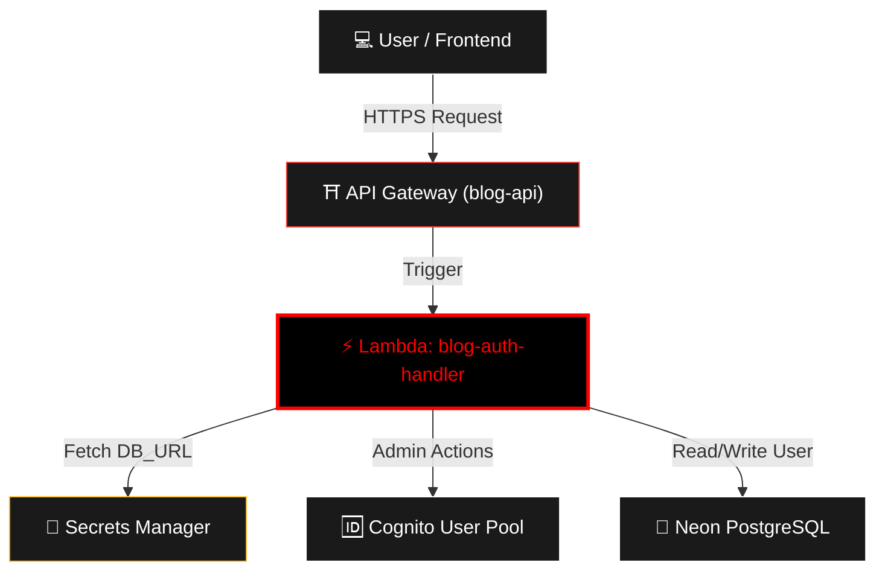

# 🚀 blog-auth-handler

Este repositorio contiene la lógica de la función **AWS Lambda** encargada de gestionar la autenticación del blog. Está diseñada para procesar registros, inicios de sesión e integraciones sociales.

## 🏗️ Arquitectura de Integración

Este componente es invocado por el API Gateway y se comunica con servicios de identidad y bases de datos.

