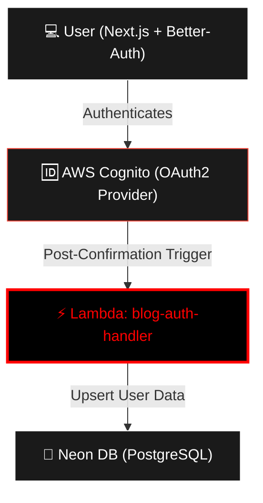

# 🚀 blog-auth-handler

Este repositorio contiene la función **AWS Lambda** (Python) que sirve como el "backend" de sincronización para **Better-Auth**. Se activa mediante disparadores de **Amazon Cognito** cuando un usuario se registra o inicia sesión.

## 🏗️ Arquitectura: Better-Auth + Cognito Integration

Esta Lambda asegura que cada vez que un usuario se autentique mediante Better-Auth en el frontend, sus datos queden persistidos en nuestra base de datos relacional.

