# 🚀 blog-auth-handler

This repository contains the **AWS Lambda** function (Node.js 22) responsible for synchronizing confirmed users into **Amazon DynamoDB**. it serves as the **Post-Confirmation Trigger** for Amazon Cognito, ensuring high-speed, serverless user profile initialization.

## 🏗️ Architecture: Identity-First Flow

We follow a strictly serverless "Identity-First" pattern. The user profile is only created in the database after the Identity Provider (Cognito) confirms the user's email/identity.

```mermaid
graph TD
    %% Node Definitions
    User["💻 User (Next.js Frontend)"]
    Cog["🆔 Amazon Cognito (Identity Provider)"]
    L["⚡ Lambda: blog-auth-handler (Node.js 22)"]
    DB["📦 DynamoDB (Single Table Design)"]

    %% Truth Flow
    User -- "1. Intent: Signup & Verify" --> Cog
    Cog -- "2. Trigger: Post-Confirmation" --> L

    %% Synchronization
    L -- "3. Persistent Sync (PutItem)" --> DB

    %% Pro Styles (Dark Mode + Red/White)
    style L fill:#000,stroke:#ff0000,stroke-width:3px,color:#ff0000
    style Cog fill:#1a1a1a,stroke:#ffffff,stroke-width:1px,color:#ffffff
    style DB fill:#1a1a1a,stroke:#ffffff,stroke-width:1px,color:#ffffff
    style User fill:#1a1a1a,stroke:#ffffff,stroke-width:1px,color:#ffffff
```

